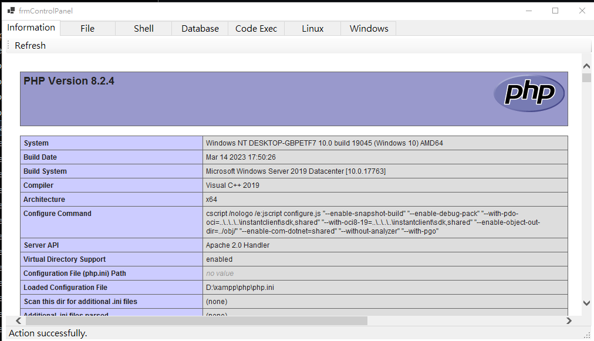
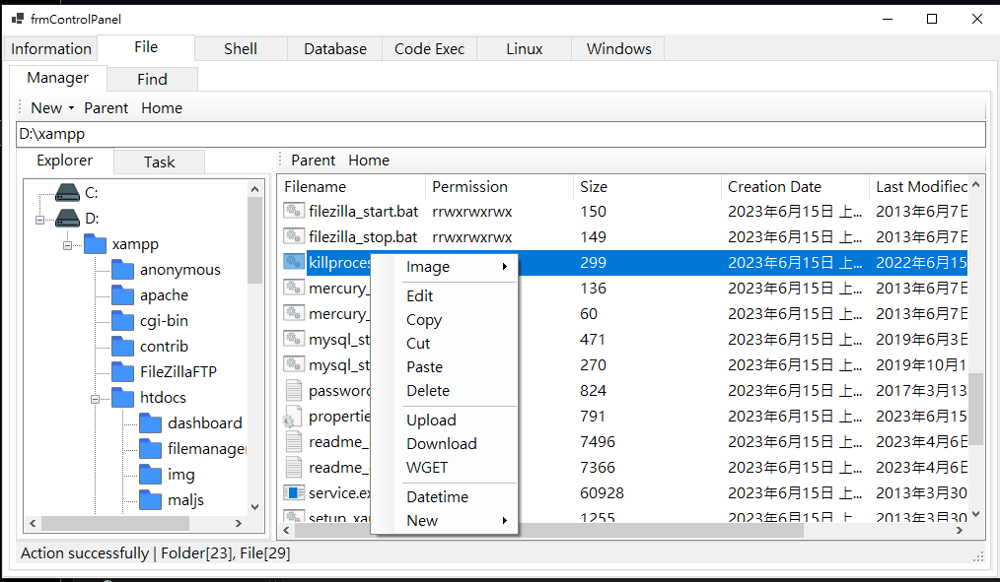
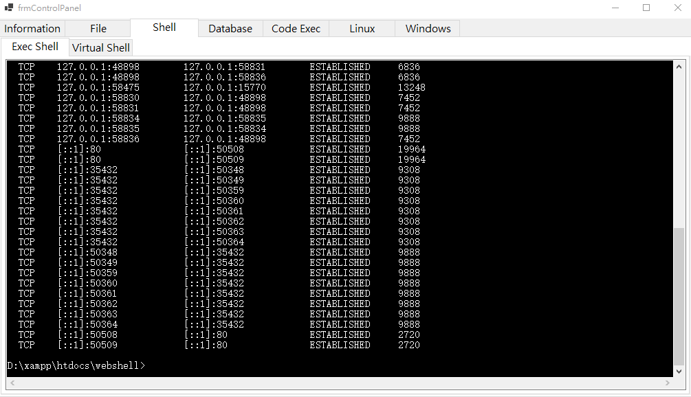
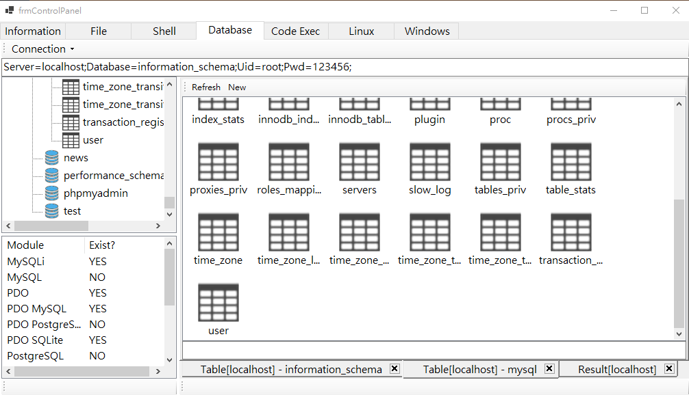
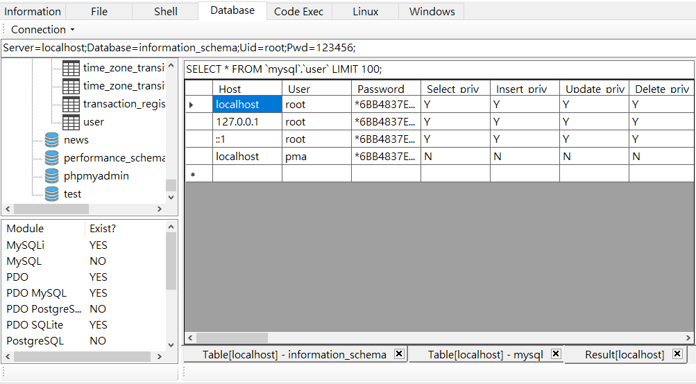
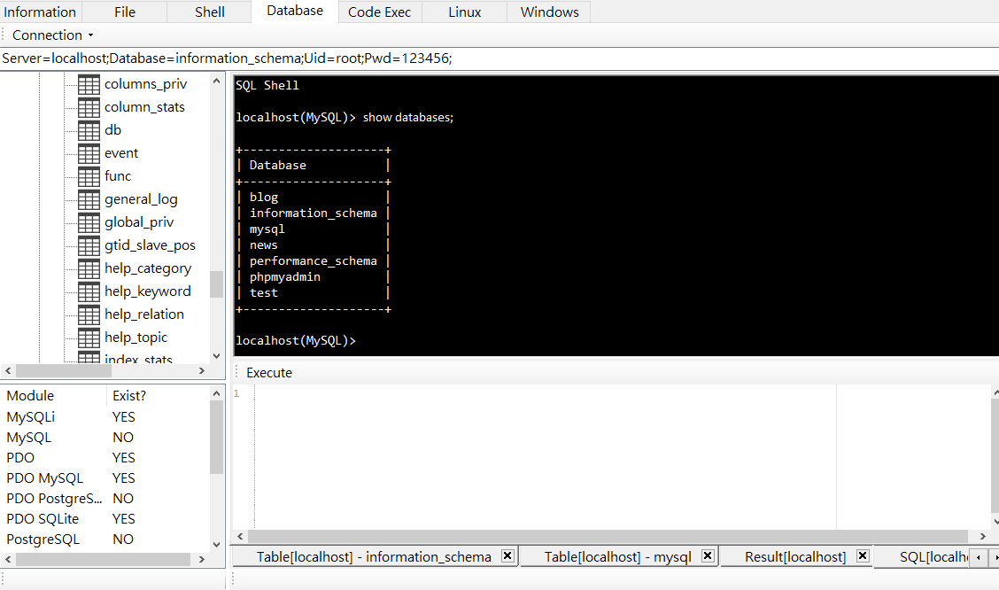

# Alien

Alien is a C#-based webshell management tool for penetration testing.

**This tool is currently being rewritten, as the previous four versions had architectural and design limitations due to my earlier experience level**.

  

# Todo List
- Webshell
- Features

## NebulaPulsar and DarkMatter

## EventHorizon

EventHorizon is a module within Alien that provides tampering features for evasion.

## DriftingComet

DriftingComet is one of the modules used by Alien. It provides a multi-hopping feature.

# Debug

# Solved

# Screenshots

## Information

## File

## Shell

## Database

